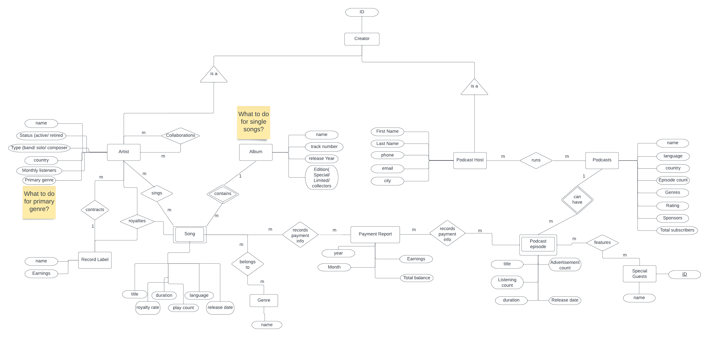

# WolfMedia
Design and build a database system for Wolf Media, a media streaming service. This is an audio and media streaming service, like Spotify or Apple Music. The administrators and management of the streaming service will use the database system
## Requirement

### Narrative
By talking to the managers, we have elicited for you the following information for the media streaming service.
1. The media streaming service features songs and podcasts by various artists, hosts, and record labels. Each song has at least one artist which can be a band, solo musician, and/or composer. Each song is owned by the record label of its main artist. Podcasts have at least one host with podcast episodes that sometimes feature special guests.
2. The media streaming service generates monthly payments based on royalties collected. Royalties are generated based on a royalty rate for each song times the total play count. The royalties are paid to the record label which keeps 30% and distributes the remainder evenly among the respective artist(s). Both active, retired and guest artists receive royalties.
3. Podcast hosts are paid a single flat fee per released episode and an additional bonus based on the total advertisements presented within the episode. Special guest(s) are volunteers and do not receive payments.
4. All payment information for artist(s), record label(s) and podcast host(s) are recorded and maintained by the media streaming service. All relevant information for the songs, artists, albums, podcasts, host(s), and episodes should be kept in the database system. Monthly listeners and total subscribers include unique active listener accounts that subscribe to the artist or podcast. Subscribers make monthly payments to the media streaming service.
5. Management collects and analyzes data on various aspects of the streamed items and associated parties including but not limited to song play count, podcast subscribers, ratings, and all payments made. Generated reports include monthly, yearly, and total payment summaries for each artist, record label, and podcast host. Monthly, yearly, and total reports for podcast/song subscribers, play count, and rating (if applicable).
### Tasks and Operations
The following are the four major kinds of tasks that need to be performed using your database. Each task potentially consists of several operations; an "operation" is something that corresponds to a separate action. For example, Information Processing is considered to be one task, that involves separate operations such as entering and updating basic information about songs, and podcasts.
1. Information Processing\
Enter/update/delete basic information about songs, artists, podcast hosts, and podcast episodes. Assign songs and artists to albums. Assign artists to record labels. Assign podcast episodes and podcast hosts to podcasts.
2. Maintaining metadata and records\
Enter/update the play count for songs. Enter/update the count of monthly listeners for artists. Enter/update the total count of subscribers and ratings for podcasts. Enter/Update the listening count for podcast episodes. Find songs and podcast episodes given artist, album, and podcast.
3. Maintaining payments\
Make royalty payments for a given song. Monthly royalties are generated based on a royalty rate for each song times the total play count per month. 30% of the collected royalties are paid to the record label and the remainder is distributed evenly among all participating artists. Make payment to podcast hosts. Podcast hosts are paid a single flat fee per released episode and an additional bonus based on total advertisements per podcast episode. Receive payment from subscribers.
4. Reports\
Generate all the following reports: Monthly play count per song/album/artist. Calculate total payments made out to host/artist/record labels per a given period. Total revenue of the streaming service per month, per year. Report all songs/podcast episodes given an artist, album, and podcast.

### Required data points
Maintain information on at least the following entities/attributes:
* Song:
song title, artist(s), duration, genre(s), album, play count, release date, release country, language, royalty rate, collaborators (guest artist), royalty_paid (status of whether the current royalty has been paid out)
* Artist: name, collaboration(s), status (active/retired), type (Band/musician/composer), country, primary genre, monthly listeners, album(s), record label
* Record label: record label name, contracted artist(s),
* Album: album name, artist(s), song(s), track number(s), release year, Edition (special, limited, collector's edition)
* Podcast: podcast host, podcast name, language, country, episode count, genre(s), rating, sponsor(s), total subscribers
* Podcast host: first name, last name, phone, email, city, podcast(s)
* Podcast episode: episode title, duration, release date, listening count, special guest(s), advertisement count
* User: first name, last name, phone, email, registration date, status of subscription, monthly subscription fee

## Solution

This repo contains a service layer written in Java which connects to a mariadb database to perform all possible operations based on the given requirement.

### ER Diagram

### Design Assumptions
* Record Labels have unique registered names
* Each Album is created by exactly one artist who is the primary artist of the Album and all Songs linked to that album
* Each song is part of exactly one Album. Solo Songs also belong to independent albums.
* The primary artist of a song is identified by the relation that every song is part of 1 album and every album has 1 creator artist. Songs have track numbers and duration greater than 0 and a royalty rate from 0 to 100.
* Users can buy Subscription Only Monthly. Its expiry status can be calculated as 30 days from the last payment date. 
* Sponsors for podcasts have a unique name. How much amount they sponsor is not captured by this system.
* Total number of times a podcast episode is streamed per day is stored.
* Royalty is paid out for each Song generated during each month. * Based on this amount we can get the split of how much is given to artists and record labels based on their relations with Songs.
* Two Podcast payment is done each month. A Flat fee is paid each month for each episode and a payment based on ad rate and stream count is calculated for each month and each episode. 
* In case of revenue calculation, we only consider User subscription fees as our source of revenue. Sponsor payments are not included.
* An artist's listener count is assumed to be the same as the number of times an artist's song has been played i.e. a playcount of all songs of the artist. Thus artist listener count doesn't need to be recorded separately.
